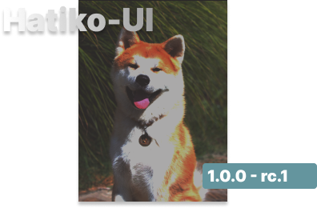

<div align="center">

</div>

<div align="center">
 
 
 
 \

 


</div>


## Hatiko-UI Docs 📙

- [Installation](#installation)  
- [Components List](#components)  
- [Examples](#examples)  
- [CLI](#cli)  


</br>


<div>
 <b>Hatiko-UI</b> is a library of UI ready components for React. It contains components as well as styles that are expressed using css modules. In addition, there is a CLI that allows you not to pull everything into the project, but only the necessary part. The main feature is that the components are not imported directly from the library, but a folder with ready components is created. Thanks to this you can always customize them by changing the code and styles and create your own ready-made Ui libraries based on it. 
</div>

</br>

> ℹ️ INFO  
> The library is still in early access.

</br>

<div id="installation">

### 🏠 Installation

1. Create project

```
npm create vite@latest
```
</br >

 2. Library installation (can be skipped)   

```
npm install -D hatiko-ui
```
Install the library as a `dev dependency` and then use the CLI

</br >

```
npm install -g hatiko-ui
```
You can install the library globally. This way you don't have to install the library in your project all the time

</br >


 3. Using the CLI

```
hatiko-ui add Button
```
Detailed information about all commands can be found in the CLI section

</br >

```
npx hatiko-ui add Button
```
If you don't want to install the library, you can use `npx`

</br >


</div>

</br >


<div id="components">
 
### 📃 Component List
 
A table of components is provided below. There are also designations such as:
- Predominant ✅  
- Absent ❌  
- In development 🛠️  
- Covered by tests 🧪  
- Stories 📕  
- Old implementation 🗝️

There are also options for compound and uncompound components. And availability of component histories and test coverage


| Component           | Status | Variants    |Availability|
|---------------------|--------|-------------|------------|
| **Button**          | ✅    |  `Uncompound` \| `Compound` | 🧪📕|
| **Input**          | ✅    |  `Uncompound` \| `Compound`| 🧪📕|
| **Textarea**          | ✅    |  `Uncompound` \| `Compound`|🧪📕|
| **Checkbox**          | ✅    |  `Uncompound` \| `Compound` | 🧪📕|
| **Radio**          | ✅    |  `Uncompound`\| `Compound` |🧪📕|
| **Modal**          | ✅    |  `Uncompound` \| `Compound`| 🧪📕|
| **Drawer**          | ✅    |  `Uncompound` \| `Compound` |🧪📕 |
| **Badge**          | ✅    |  `Uncompound` | 🧪📕|
| **Select**          | ✅    |  `Uncompound` \| `Compound` |🧪📕 |
| **Dropdown**          | ✅    |  `Uncompound`\| `Compound` |🧪📕|
| **Typography**          | ✅    |  `Uncompound` |🧪📕 |
| **Linkify**          | ✅    |  `Uncompound` |🧪📕 |
| **Confirm**          | ✅    |  `Uncompound`\| `Compound` |🧪📕|
| **Accordion**          | ✅    |  `Uncompound`\| `Compound` |🧪📕 |
| **Progressbar**          | ✅    |  `Uncompound`\| `Compound` |🧪📕|
| **Range**          | ✅    |  `Uncompound`\| `Compound🗝️` |🧪📕 |
| **Breadcrumbs**          | ✅    |  `Uncompound`\| `Compound` |🧪📕 |
| **Pagination**          | ✅    |  `Uncompound`\| `Compound` |🧪📕 |
| **FileUpload**          | ✅    |  `Uncompound` |🧪📕|
| **ImagePopup**          | ✅    |  `Uncompound` |🧪📕|
| **Tooltip**          | ✅    |  `Uncompound` |🧪📕|
| **InputOTP**          | ✅    |  `Uncompound` |🧪📕|
| **Toast**          | ✅    |  `Uncompound` |🧪📕|
| **Avatar**          | ✅    |  `Uncompound` |🧪📕|
| **Switch**          | ✅    |  `Uncompound` |🧪📕|
| **Navigation Menu**          | ✅   | `Uncompound`\| `Compound` |🧪📕|
| **Tabs**          | ✅    |  `Uncompound` |🧪📕|
| **Table**          | ✅    |  `Uncompound`\| `Compound` |🧪📕|


</div>

</br>

<div id="examples">

### 📚 Examples
Here are examples of using components with descriptions of their props. Each component has several use cases, depending on which props it contains.


<details>
</br>
<summary>Uncompound components</summary>
<details>
</br>
<summary>Button</summary>


|  Props |    Types | Compulsory |
|----------------|-----|---------------|
| Children    |  `primary` \| `outline` | true |
| variant    |  `primary` \| `outline` | true |
| startIcon   |  `ReactNode` | false|
| endIcon   |  `ReactNode` | false|
| loading   |  `ReactNode` | false|
| ...props   |  `button props` | false|

</br>


```javascript
      <Button
          variant='primary'
          onClick={onAddTask}
          endIcon={<PluseIcon />}
          disabled
      >
         Your text...
      </Button>
```

</br>

</details>


<details>
</br>
<summary>Input</summary>


|  Props |    Types | compulsory |
|----------------|-----|---------------|
| variant    |  `primary` \| `outline` | true |
| label |  `string` | false|
| error   |  `string` | false|
| endIcon   |  `ReactNode` | false|
| ...props   |  `input props` | false|

</br>


```javascript
      <Input
          variant='primary'
          onChange={handleValue}
          label="username"
          error="This field must be filled in"
      />
```

</br>
</details>


<details>
</br>
<summary>Textarea</summary>


|  Props |    Types | Compulsory |
|----------------|-----|---------------|
| variant    |  `primary` \| `outline` | true |
| label |  `string` | false|
| error   |  `string` | false|
| ...props   |  `input props` | false|

</br>


```javascript
      <Textarea
          variant='primary'
          onChange={handleValue}
          label="About us"
          error="This field must be filled in"
      />
```

</br>
</details>

<details>
</br>
<summary>Checkbox</summary>


|  Props |    Types | Compulsory |
|----------------|-----|---------------|
| label |  `string` | false|
| className   |  `string` | false|
| getCheckboxState   |  `(state: boolean) => void` | false|
| ...props   |  `input props` | false|

</br>


```javascript
      <Checkbox
          label={data.name}
          className="checkbox_custom"
          getCheckboxState={onActiveCheckbox}
      />
```

- <b>getCheckboxState</b> - function that returns boolean type, depending on the checkbox activity

</br>
</details>

<details>
</br>
<summary>Modal</summary>


|  Props |    Types | Compulsory |
|----------------|-----|---------------|
| children |  `ReactNode` | true|
| classNameOverlay   |  `string` | false|
| classNameBody   |  `string` | false|
| title   |  `string` | false|
| closeBtn   |  `boolean` | false|
| isOpen   |  `boolean` | true|
| closeModal   |  `() => void` | true|
| lazy  |  `boolean` | false|

</br>


```javascript
      <Modal
          isOpen={isOpenModal}
          closeModal={onCloseModal}
          title="Active users list"
          lazy
      >
          <UserList />
          ...
      </Modal>
```

- <b>lazy</b> - a component with this parameter will not be embedded in the tree house during rendering until the component is processed

</br>
</details>

<details>
</br>
<summary>Drawer</summary>


|  Props |    Types | Compulsory |
|----------------|-----|---------------|
| children |  `ReactNode` | true|
| classNameOverlay   |  `string` | false|
| classNameBody   |  `string` | false|
| title   |  `string` | false|
| closeBtn   |  `boolean` | false|
| isOpen   |  `boolean` | true|
| closeDrawer   |  `() => void` | true|
| lazy  |  `boolean` | false|

</br>


```javascript
      <Drawer
          isOpen={isOpenModal}
          closeDrawer={onCloseDrawer}
          title="Active users list"
          lazy
      >
          <UserList />
          ...
      </Drawer>
```

- <b>lazy</b> - a component with this parameter will not be embedded in the tree house during rendering until the component is processed

</details>


<details>
</br>
<summary>Badge</summary>


|  Props |    Types | Compulsory |
|----------------|-----|---------------|
| variant |    \|   \|  | true|
| text   |  `string` | false|
| className   |  `string` | false|
</br>


```javascript
      <Badge
          text={data.orderStatus}
          variant="success"
      />
```

</br>

</details>

<details>
</br>
<summary>Select</summary>


|  Props |    Types | Compulsory |
|----------------|-----|---------------|
| items | `string[]`   | true|
| classNameMenu   |  `string` | false|
| classNameShowBar   |  `string` | false|
| getActiveItem   |  `(value: string) => void` | false|

</br>


```javascript
      <Select
          items={["Item 1", "Item 2", "Item 3", "Item 4"]}
          classNameShowBar="select_bar"
          getActiveItem={onGetActiveItem}
      />
```

</br>
</details>

<details>
</br>
<summary>Dropdown</summary>


|  Props |    Types | Compulsory |
|----------------|-----|---------------|
| items | `Array<{link:string, text:string, id:number \| string}>`   | true|
| title   |  `string` | true|
| classNameMenu   |  `string` | false|
| classNameShowBar   |  `string` | false|

</br>


```javascript
      <Drowdown
          title="Food menu"
          items={[
            {
                id:1,
                text:"Pizzas",
                link:"/menu/pizzas"
            },
            {
                id:2,
                text:"Desserts",
                link:"/menu/desserts"
            }
          ]}
          classNameShowBar="dropdown_bar"
      />
```

</br>
</details>


<details>
</br>
<summary>Typography</summary>


|  Props |    Types | Compulsory |
|----------------|-----|---------------|
| children | `ReactNode`   | true|
| variant   |  `regular_16` \| `medium_16` \| `bold_16` \| `regular_24` \| `medium_24` \| `bold_24` | true|
| tag   |  `h1` \| `h2` \| `h3` \| `h4` \| `h5` \| `h6` \| `div` \| `p` \| `span`| true|

</br>


```javascript
      <Typography
          variant="bold_24"
          tag="h1"
      >
          Title typography
      </Typography>
```

</br>
  
</details>

<details>
</br>
<summary>Linkify</summary>


|  Props |    Types | Compulsory |
|----------------|-----|---------------|
| children | `string`   | true|

</br>


```javascript
      <Linkify>
          Go to the website: https://github.com/Meow-Double
      </Linkify>
```
- <b>Linkify</b> - a component that accepts text, and if links are encountered in the text, they will be replaced by an html tag `<a href=“...”>...</a>`


</br>
</details>


<details>
</br>
<summary>Linkify</summary>


|  Props |    Types | Compulsory |
|----------------|-----|---------------|
| title | `string`   | true|
| classNameOverlay | `string`   | false|
| classNameBody | `string`   | false|
| getAnswer | `(answer: boolean) => void`   | true|
| isOpen | `boolean`   | true|
| closeWindow | `() => void`   | true|
| lazy | `boolean`   | false|

</br>


```javascript
      <Confirm 
            title="Do you use a hatiko-ui?"
            isOpen={isOpen}
            closeWindow={closeWindow}
            getAnswer={onGetAnswer}
            lazy
      />
```

</br>
  
</details>


<details>
</br>
<summary>Accordion</summary>


|  Props |    Types | Compulsory |
|----------------|-----|---------------|
| items | `Array<{title:string, text:string, id:number \| string }>`   | true|
| classNameText | `string`   | false|
| classNameTitle | `string`   | false|
| toggle | `boolean`   | false|

</br>

```javascript
      <Accordion 
             items={[
                {
                id:1,
                title:"What is hatiko-ui?",
                text:"This is an unpopular ui component library for react, which is designed to make it easier to write your own ui components and speed up the development process."
                },
                {
                id:2,
                title:"Desserts",
                text:"/menu/desserts"
                }
            ]}
            classNameTitle="accrodion_class"
            toggle
      />
```
- <b>toggle</b> - allows you to not close previous accordion tabs that have been opened

</br>
  
</details>


<details>
</br>
<summary>Progressbar</summary>


|  Props |    Types | Compulsory |
|----------------|-----|---------------|
| progress | `number`   | true|
| title | `string`   | false|
| displayProgress | `boolean`   | false|

</br>

```javascript
      <Progressbar
            progress={45}
            title="Test covered"
            displayProgress
      />
```
- <b>displayProgress</b> - displays progress percentages

</br>

</details>


<details>
</br>
<summary>Range</summary>


|  Props |    Types | Compulsory |
|----------------|-----|---------------|
| defaultValue | `number`   | false|
| min | `number`   | false|
| max | `number`   | false|
| step | `number`   | false|
| getCurrentValue | `(value: number) => void`   | false|

</br>


```javascript
      <Range
            defaultValue={50}
            step={10}
            getCurrentValue={onGetValue}
      />
```
- <b>getCurrentValue</b> - gets the current value of range
- <b>step</b> - default:`1`
- <b>min</b> - default:`1`
- <b>max</b> - default:`100`

</br>

</details>

<details>
</br>
<summary>Breadcrumbs</summary>


|  Props |    Types | Compulsory |
|----------------|-----|---------------|
| items | `Array<{label:string, path:string}>`   | true|
| sign | `number`   | false|

</br>


```javascript
      <Breadcrumbs
            items={[
                  {
                        label:"Menu",
                        path:"/menu",
                  },
                  {
                        label:"pizza",
                        path:"/menu/pizza"
                  }
            ]}
            sign="/"
      />
```
- <b>sign</b> - default:`/`

> ℹ️ INFO
> For this component you need to install the library `react-router-dom`

</br>
</details>


<details>
</br>
<summary>Pagination</summary>


|  Props |    Types | Compulsory |
|----------------|-----|---------------|
| page | `number`   | true|
| totalPage | `number`   | true|
| siblings | `number`   | true|
| setPages | `(value: number) => void`   | true|

</br>

```javascript
      <Pagination
            page={4}
            totalPage={10}
            siblings={1}
            setPages={(value) => setValue(value)}
      />
```
- <b>page</b> - сurrent page (active page)
- <b>totalPage</b> - total number of pages 
- <b>siblings</b> - range of visible pagination pages
- <b>setPages</b> - a function that takes as an argument a value - the page that will be changed (most often useState)


> ℹ️ INFO  
> Built-in utilities are used, don't forget to add them to the project when you use this component

</br>

</details>


<details>
</br>
<summary>FileUpload</summary>


|  Props |    Types | Compulsory |
|----------------|-----|---------------|
| getFiles | `number`   | true|
| className | `number`   | false|
| fileAccept | `number`   | false|


</br>

```javascript
      <FileUpload
            className="upload_class"
            fileAccept=".png, .jpg, .jpeg"
            setPages={(files) => setFiles(files)}
      />
```
- <b>fileAccept</b> - specify, comma separated, the file formats that will be allowed to be selected

</br>

</details>


<details>
</br>
<summary>ImagePopup</summary>


|  Props |    Types | Compulsory |
|----------------|-----|---------------|
| images | `string[]`   | true|
| isOpen | `boolean`   | true|
| closePopup | `() => void`   | true|
| classNameOverlay | `string`   | false|
| classNameImages | `string`   | false|

</br>

```javascript
      <ImagePopup
            images=[ImageFirst, ImageSecond, ImageThird]
            isOpen={isOpen}
            closePopup={onClosePopup}
            classNameImages="images_class"
      />
```

</br>

</details>


<details>
</br>
<summary>Tooltip</summary>


|  Props |    Types | Compulsory |
|----------------|-----|---------------|
| children | `ReacNode`   | true|
| title | `string`   | true|
| className | `() => void`   | false|

</br>

```javascript
      <Tooltip
            title="It's a tooltip component"
            isOpen={isOpen}
      >
            Tooltip component
      </Tooltip>
```

</br>

</details>


<details>
</br>
<summary>InputOTP</summary>


|  Props |    Types | Compulsory |
|----------------|-----|---------------|
| getValue | `(value: string) => void`   | true|
| length | `number`   | false|
| className | `string`   | false|


</br>

```javascript
      <InputOTP
            className="input-otp_class"
            getValue={getInputValue}
            length={6}
      />
```

</br>

</details>


<details>
</br>
<summary>Toast</summary>


|  Props |    Types | Compulsory |
|----------------|-----|---------------|
| toastList | `Array<ToastListTypes>`   | true|
| clearToasts | `(toasts: ToastListTypes[]) => void`   | true|
| position | `PositionTypes`   | false|
| durationDelete | `number`   | false|

<b>Types</b>

```typescript
      type ToastVariants = 'success' | 'danger' | 'info' | 'warning';

      type PositionTypes = 'bottom-right';

      type ToastListTypes = {
            id: number;
            title?: string;
            description: string;
            variant: ToastVariants;
      };

```

</br>

<b>Toast</b>

```javascript
      <Toast
            toastList={[{
                  id:1,
                  variant:"success",
                  description:"This is a toast component"
            }]}
            clearToasts={getInputValue}
            durationDelete={3000}
      />
```

</br>
- <b>durationDelete</b> - The default will be 2000 milliseconds
</details>


<details>
</br>
<summary>Avatar</summary>


|  Props |    Types | Compulsory |
|----------------|-----|---------------|
| path | `string`   | true|

</br>

```javascript
      <Avatar path="./hatiko-ui/avatar.png" />
```

</br>
- <b>path</b> - Path to the image file
</details>


<details>
</br>
<summary>Switch</summary>


|  Props |    Types | Compulsory |
|----------------|-----|---------------|
| getState | `(value: boolean) => void`   | false|
| className | `string`   | false|
| checked | `boolean`   | false|

</br>


```javascript
      <Switch getState={value => setState(value)} checked />
```

</details>


<details>
</br>
<summary>Navigation Menu</summary>


|  Props |    Types | Compulsory |
|----------------|-----|---------------|
| items | `NavigationMenuItem[]`   | true|
| title | `string`   | true|
| className | `string`   | false|

<b>Types</b>

```typescript
      type NavigationMenuItem = {
            id: number | string;
            text: string;
            path: string;
      };
```

</br>

<b>NavigationMenu</b>


```javascript
      <NavigationMenu
            items={[
                  {
                        id:1,
                        text:"item1",
                        path:"/item1"
                  },
                     {
                        id:2,
                        text:"item2",
                        path:"/item2"
                  },
                     {
                        id:2,
                        text:"item2",
                        path:"/item2"
                  }
            ]} 
       />
```

</details>

<details>
</br>
<summary>Tabs</summary>


|  Props |    Types | Compulsory |
|----------------|-----|---------------|
| schema | `T`   | true|
| className | `string`   | false|
| classNameContent | `string`   | false|

<b>Types</b>

```typescript
      export interface TabsProps<T> {
            schema: T;
            className?: string;
            classNameContent?: string;
      }

      //T extends Record<String, ReactNode>
```

</br>

<b>Tabs</b>


```javascript
      <Tabs
            items={{
                  hatikoUi:"This library is hatikoUI",
                  Author:"This is text about author",
            }} 
       />
```

</details>


<details>
</br>
<summary>Table</summary>

;
;


|  Props |    Types | Compulsory |
|----------------|-----|---------------|
| schema | `T`   | true|
| className | `string`   | false|

<b>Types</b>

```typescript
      export interface TableProps<T> {
            schema: T;
            className?: string;
      }

      //T extends Record<String, ReactNode[]>
```

</br>

<b>Tabs</b>


```javascript
      <Table
            items={{
                  row1:["column1", 2, 3],
                  row2:["column1", null, "column3"],
                  row3:["column1", "column2", 2]
            }} 
       />
```

</details>
</details>


<!-- --------------------------------------------------------------------------- -->
<!-- --------------------------------------------------------------------------- -->


<details>
</br>
<summary>Compound components</summary>

<details>
</br>
<summary>Button</summary>

<details>
</br>
<summary>ButtonCompound</summary>

|  Props |    Types | Compulsory |
|----------------|-----|---------------|
| children | `ReactNode`   | true|
| variant | `ButtonPropsVariants`   | true|
| ...props   |  `button props` | false|

<b>Types</b>

```typescript
      type ButtonPropsVariants = 'primary' | 'outline';

      interface ButtonProps extends ComponentProps<'button'> {
            children: ReactNode;
            variant: ButtonPropsVariants;
      }
```

</details>

<details>
</br>
<summary>ButtonIcon</summary>

|  Props |    Types | Compulsory |
|----------------|-----|---------------|
| icon | `ReactNode`   | true|

<b>Types</b>

```typescript
      interface ButtonIconProps {
            icon: ReactNode;
      }
```

</details>


</br>

<b>Button Example 1</b>


```javascript
      <ButtonCompound>
            <span>Search</span>
            <ButtonIcon icon={<SearchIcon />}>
      </ButtomCompound>
```
<b>Button Example 2</b>

```javascript
      <ButtonCompound>
            <ButtonIcon icon={<FindIcon />}>
            <span>Find</span>
      </ButtomCompound>
```
<b>Button Example 3</b>

```javascript
      <ButtonCompound>
           loading...
      </ButtomCompound>
```

</details>


<!-- --------------Input Compound------ -->

<details>
</br>
<summary>Input</summary>

<details>
</br>
<summary>InputCompound</summary>

|  Props |    Types | Compulsory |
|----------------|-----|---------------|
| children | `ReactNode`   | true|
| ...props   |  `label props` | false|

<b>Types</b>

```typescript
      interface InputCompoundProps extends ComponentProps<'label'> {
            children: ReactNode;
      }
```

</details>

<details>
</br>
<summary>InputItem</summary>

|  Props |    Types | Compulsory |
|----------------|-----|---------------|
| variant | `InputVariants`   | true|
| error | `boolean`   | false|
| ...props   |  `input props` | false|

<b>Types</b>

```typescript
      type InputItemVariants = 'primary' | 'outline';

      interface InputItemProps extends ComponentProps<'input'> {
            variant: InputItemVariants;
            error?: boolean;
      }

```

</details>

<details>
</br>
<summary>InputGroup</summary>

|  Props |    Types | Compulsory |
|----------------|-----|---------------|
| variant | `InputVariants`   | true|
| className | `string`   | false|

<b>Types</b>

```typescript
      interface InputGroupProps {
            children: ReactNode;
            className?: string;
      }
```

</details>


<details>
</br>
<summary>InputText</summary>

|  Props |    Types | Compulsory |
|----------------|-----|---------------|
| text | `string`   | true|
| className | `string`   | false|

<b>Types</b>

```typescript
      interface InputTextProps {
            text: string;
            className?: string;
      }
```

</details>

<details>
</br>
<summary>InputErrorTex</summary>

|  Props |    Types | Compulsory |
|----------------|-----|---------------|
| text | `string`   | true|
| className | `string`   | false|

<b>Types</b>

```typescript
      interface InputErrorTextProps {
            text: string;
            className?: string;
      }
```

</details>


</br>

<b>Input Example 1</b>

```javascript
      <InputCompound>
            <InputText text="username"/>
            <InputItem error={!!error.message.text} variant="primary"/>
            <InputErrorText text={error.message.text}>
      </InputCompound>
```

<b>Input Example 2</b>

```javascript
      <InputCompound>
            <InputGroup>
                  <InputItem variant="outline"/>
                  <SearchIcon />
            </InputGroup>
      </InputCompound>
```

</details>


</details>


</div>


</br>

<div id="cli">

### 🚀 CLI 

`hatiko-ui` - includes a command to automatically create components with the required directories and files

- `add <...arguments>` - Adds the components specified as arguments to the catalog

<b>Examples</b>

```javascript
hatiko-ui add Button Input Select
```

- Always with the components will come the styles folder, which contains the main styles for the components

>ℹ️ INFO
>Depending on the specified components, an icons folder may be created that contains the desired icons

</br>

### 📁 Main catalog: `hatiko-ui`
Contains three main folders:
- `components` – contains the catalogs of the individual components and the file `index.ts`.
- `styles` – includes three files: `index.css`, `reset.css`, `variables.css`.
- `icons` – contains files with icons and `index.ts` to export them.

```plaintext

components/
│── Button/
│   ├── Button.tsx
│   ├── Button.module.css
│── Input/
│   ├── Input.tsx
│   ├── Input.module.css
│── Modal/
│   ├── Modal.tsx
│   ├── Modal.module.css
│── index.ts

styles/
│── index.css
│── reset.css
│── variables.css

icons/
│── CloseIcon.tsx
│── SearchIcon.tsx
│── index.ts
```

</br>
 
</div>
